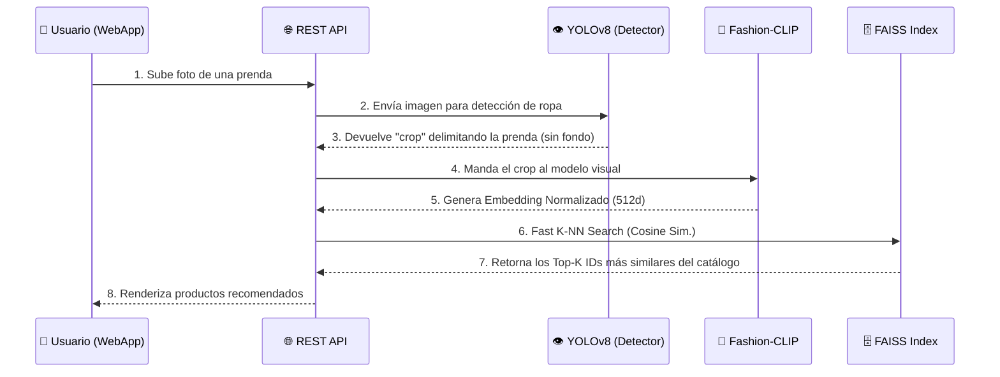

# Visual Search con Fashion-CLIP 👔✨
**Sistema de Recuperación de Imágenes de Moda usando IA Contrastiva**

<p align="center">
  
  
  
  
</p>

## Overview del Proyecto

Este repositorio contiene el código fuente para una solución avanzada de **Visual Search** diseñada durante la HackUDC 2026. El objetivo principal de este proyecto es resolver el desafío de encontrar prendas de ropa similares dentro de un inmenso catálogo de imágenes, un problema fundamental en el sector e-commerce (Retail/Fashion).

Para lograr esto, hemos implementado una estrategia de **Fine-Tuning sobre Fashion-CLIP** utilizando _Hard Negative Mining_ y _Contrastive Learning_ (INFO-NCE Loss). Nuestro sistema aprende a mapear imágenes a un espacio vectorial denso, donde las prendas visual y semánticamente similares se encuentran cercanas, permitiendo realizar búsquedas ultra-rápidas mediante similitud de coseno con FAISS.

## Arquitectura y Tech Stack

El pipeline ha sido diseñado para alto rendimiento y escalabilidad:

- **Core Metric Learning**: Modelo base [Fashion-CLIP](https://huggingface.co/patrickjohncyh/fashion-clip), optimizado con una cabeza de proyecciones discriminativa.
- **Detección de Objetos**: YOLOv8 para extraer crops precisos de las prendas y aislar el ruido del fondo (fondos complejos, posados de modelos).
- **Frameworks Principales**: PyTorch, Hugging Face `transformers`, y `timm` (ConvNeXt-Tiny como backbone alternativo/ensemble).
- **Búsqueda Vectorial**: FAISS (Meta) para indexación y re-ranking ultrarrápido a gran escala.
- **Hardware de Entrenamiento**: Entrenado en la nube usando instancias **RunPod con GPUs NVIDIA A40** (48GB VRAM), aprovechando Automatic Mixed Precision (AMP / FP16).

## Estructura del Repositorio

```text
HackUDC_2026/
├── data/                    # Datasets: catálogos de imágenes, anotaciones y bundles
├── docs/                    # Documentación técnica y diagramas de arquitectura
├── notebooks/               # Jupyter Notebooks para EDA y experimentación rápida
├── src/                     # Código fuente principal (Production-Ready)
│   ├── dataset.py           # PyTorch Dataset, DataLoaders y Augmentations
│   ├── model.py             # Definición de arquitecturas (Backbones y Projection Heads)
│   ├── finetune_clip.py     # Script principal de entrenamiento contrastivo
│   ├── build_index.py       # Generación de índices tensoriales/FAISS
│   ├── reranker.py          # Lógica de re-ranking por reglas duras (Hard Category Mask)
│   ├── final_inference.py   # Inferencia final y generación de submission
│   ├── utils.py             # Funciones auxiliares genéricas
│   └── ...
├── pyproject.toml           # Configuración del proyecto y dependencias
├── requirements.txt         # Lista de dependencias directas
└── README.md                # Este archivo
```

## Instrucciones de Uso

### Instalación

Recomendamos utilizar un entorno virtual. El proyecto soporta tanto instalación clásica mediante `pip` como la herramienta ultrarrápida `uv`.

```bash
# Opción 1: Usando pip clásico
python -m venv .venv
source .venv/bin/activate
pip install -r requirements.txt

# Opción 2: Usando uv (Recomendado)
uv venv
source .venv/bin/activate
uv pip install -r requirements.txt
```

### Pipelines de Ejecución

**1. Entrenamiento del Modelo (Fine-Tuning)**
Para iniciar el fine-tuning de Fashion-CLIP con tus datos:
```bash
python src/finetune_clip.py --batch_size 64 --epochs 10 --lr 3e-5
```

**2. Construcción del Índice Base de Datos Vectorial**
Una vez entrenado, extraemos los embeddings del catálogo y construimos el índice FAISS:
```bash
python src/build_clip_index.py --model_path checkpoints/best_model.pt
```

**3. Inferencia de Evaluación (Test Set)**
Genera el archivo CSV final con las recomendaciones priorizadas:
```bash
python src/final_inference.py --index_path faiss_index.index --output submission_final.csv
```

## 🚀 Additional Features: Full-Stack Visual Search Web App

Aunque el núcleo del reto era puramente algorítmico, como reto personal y para darle una vida real al modelo, **desarrollamos un Front-End y Back-End funcional**. Hemos desplegado un entorno web estilo e-commerce (muy al estilo del ecosistema Inditex) para que la experiencia de Visual Search pueda ser testeada en la vida real mediante una Mobile Web App.

- **Frontend (Mobile-First)**: Una interfaz premium, *clean* y minimalista que permite a los usuarios abrir la cámara de su móvil, escanear una prenda por la calle y recibir recomendaciones al instante.
- **Backend**: Una API REST rápida que conecta nuestro cliente web con el índice vectorial FAISS y nuestro modelo CLIP entrenado, procesando las inferencias visuales en tiempo real.

### 🧠 System Architecture Flow

A continuación se detalla el ciclo de vida de una petición de búsqueda visual dentro de la aplicación, ilustrando cómo intervienen los distintos modelos de IA:



## Trabajo Futuro

Debido a las estrictas limitaciones de tiempo inherentes a un formato de hackathon de 24/48 horas, varias ideas prometedoras quedaron en el tintero. Nuestro roadmap de mejoras incluye:

1. **Self-Supervised Pre-training Extendido**: Aprovechar la inmensa cantidad de imágenes sin etiquetar del catálogo para pre-entrenar con DINOv2 / MAE antes del fine-tuning contrastivo.
2. **Atención Multimodal**: Incorporar metadata de texto (descripción del producto, color, material) fusionando las representaciones de texto y visión de CLIP.
3. **Despliegue Backend (API)**: Empaquetar el sistema de inferencia usando FastAPI y contenedorización con Docker, sirviendo las búsquedas visuales a través de endpoints REST en tiempo real (< 100ms).
4. **Knowledge Distillation**: Destilar el modelo final pesado (ensemble) en una red más pequeña de forma que pueda ejecutarse en el edge (ej., aplicación móvil).
